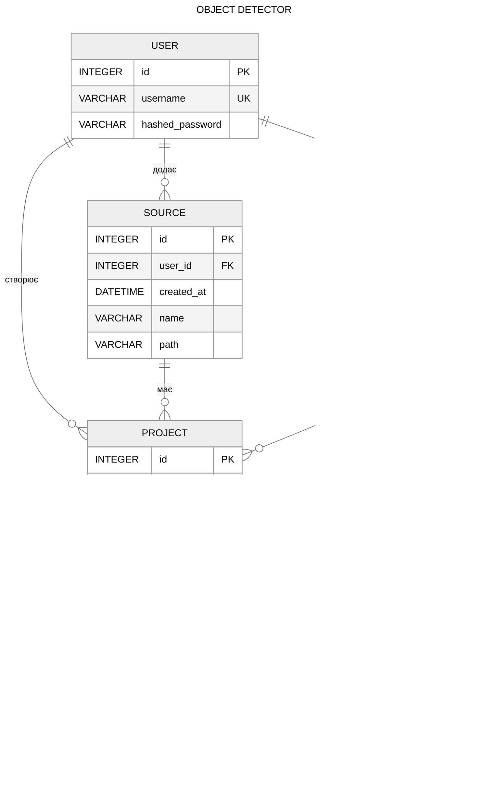

## ER-модель проєкту

```mermaid
---
title: OBJECT DETECTOR
---
%%{init: {'theme': 'neutral'}}%%
erDiagram
    USER {
        INTEGER id PK
        VARCHAR username UK
        VARCHAR hashed_password
    }
    SOURCE {
        INTEGER id PK
        INTEGER user_id FK
        DATETIME created_at
        VARCHAR name
        VARCHAR path
    }
    MODEL {
        INTEGER id PK
        INTEGER user_id FK
        DATETIME created_at
        VARCHAR name
        VARCHAR path
    }
    PROJECT {
        INTEGER id PK
        INTEGER user_id FK
        DATETIME created_at
        VARCHAR name
    }
    OBJECT {
        INTEGER id PK
        INTEGER project_id FK
        VARCHAR track_id
        DATETIME created_at
        DATETIME last_seen_at
        VARCHAR label
    }
       USER ||--o{ PROJECT : "створює"
       USER ||--o{ SOURCE  : "додає"
       USER ||--o{ MODEL   : "додає"
     SOURCE ||--o{ PROJECT : "має"
      MODEL ||--o{ PROJECT : "має"
    PROJECT ||--o{ OBJECT  : "розпізнає"
```
