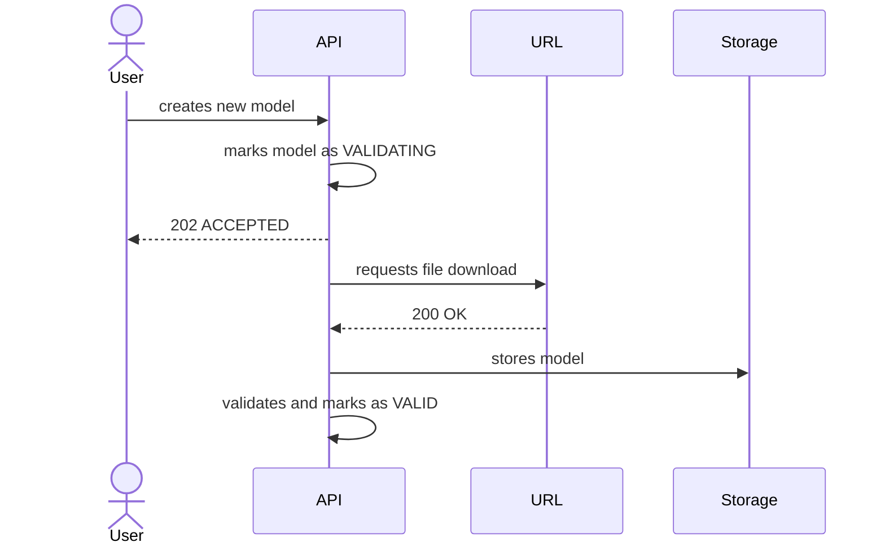
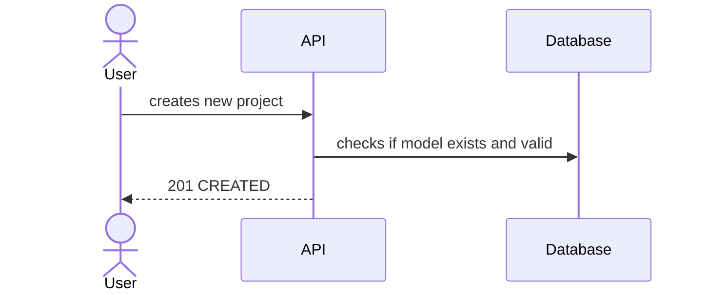
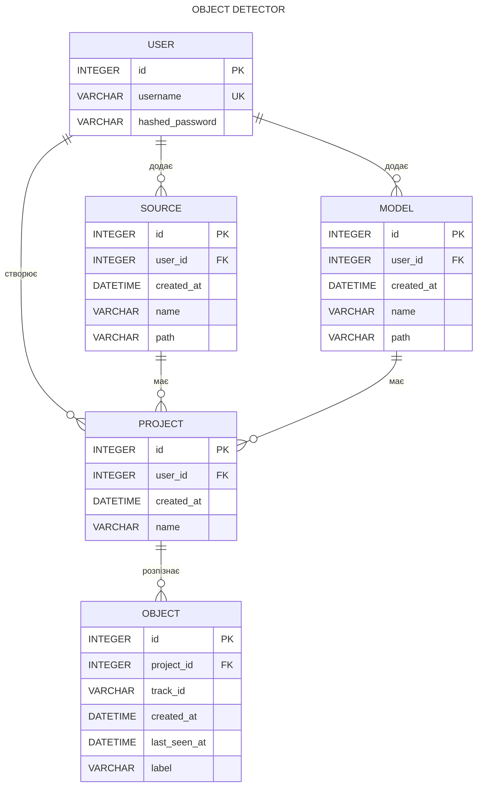

## Model management

```mermaid
sequenceDiagram

    actor User;
    participant API;
    participant URL;
    User ->> API : creates new model
    API ->> API : marks model as VALIDATING
    API -->> User : 202 ACCEPTED
    API ->> URL : requests file download
    URL -->> API : 200 OK
    API ->> Storage : stores model
    API ->> API : validates and marks as VALID
```
## Project management

```mermaid
sequenceDiagram
    actor User;
    participant API;

    User ->> API : creates new project
    API ->> Database : checks if model exists and valid
    API -->> User : 201 CREATED
```

## ER-модель проєкту

```mermaid
---
title: OBJECT DETECTOR
---
erDiagram
    USER {
        INTEGER id PK
        VARCHAR username UK
        VARCHAR hashed_password
    }
    SOURCE {
        INTEGER id PK
        INTEGER user_id FK
        DATETIME created_at
        VARCHAR name
        VARCHAR path
    }
    MODEL {
        INTEGER id PK
        INTEGER user_id FK
        DATETIME created_at
        VARCHAR name
        VARCHAR path
    }
    PROJECT {
        INTEGER id PK
        INTEGER user_id FK
        DATETIME created_at
        VARCHAR name
    }
    OBJECT {
        INTEGER id PK
        INTEGER project_id FK
        VARCHAR track_id
        DATETIME created_at
        DATETIME last_seen_at
        VARCHAR label
    }
       USER ||--o{ PROJECT : "створює"
       USER ||--o{ SOURCE  : "додає"
       USER ||--o{ MODEL   : "додає"
     SOURCE ||--o{ PROJECT : "має"
      MODEL ||--o{ PROJECT : "має"
    PROJECT ||--o{ OBJECT  : "розпізнає"
```
